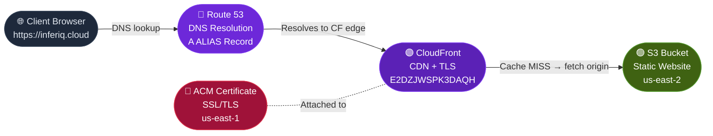
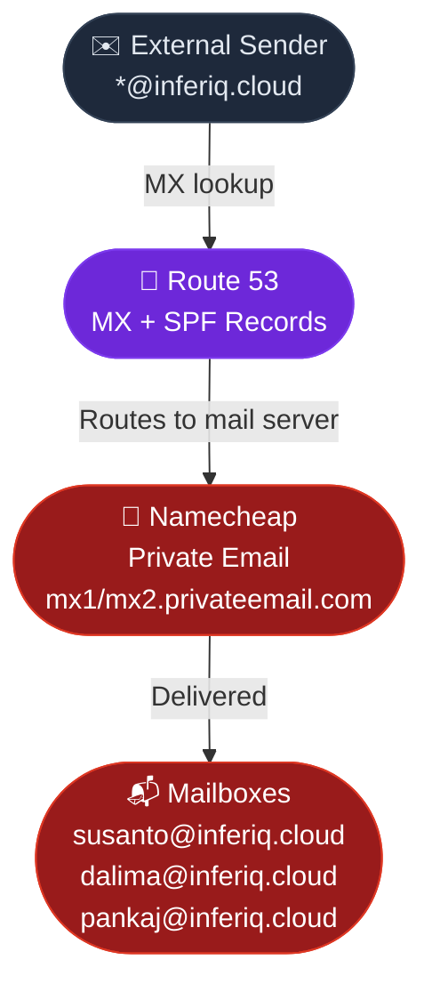
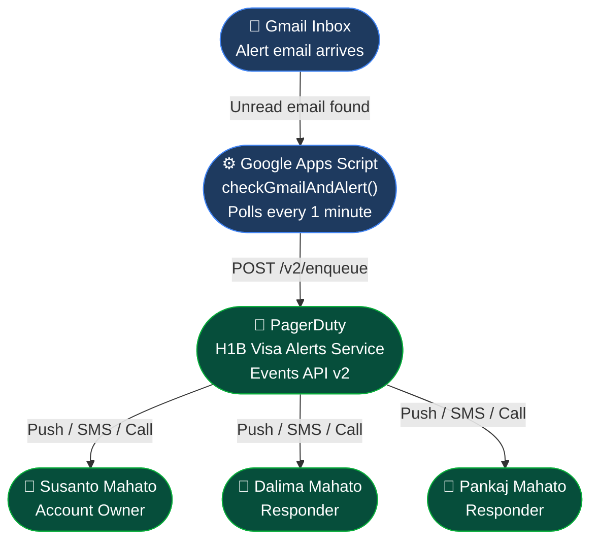

# inferiq.cloud — System Architecture

> End-to-end infrastructure, alerting, and analytics pipeline.

---

## ① Website Request Flow



---

## ② Email Flow



---

## ③ Email Alert Pipeline



---

## ④ Analytics Pipeline


---

## ⑤ Deployment Flow


---

## ⑥ DNS Record Map

```
inferiq.cloud  (Route 53 — Z0241735HP71DFG95JM0)
│
├── A     inferiq.cloud        →  d17g1mv2wb6hwa.cloudfront.net  (ALIAS)
├── A     www.inferiq.cloud    →  d17g1mv2wb6hwa.cloudfront.net  (ALIAS)
├── MX    inferiq.cloud        →  10 mx1.privateemail.com
│                                 10 mx2.privateemail.com
├── TXT   inferiq.cloud        →  v=spf1 include:spf.privateemail.com ~all
├── CNAME _202ac6d08c...       →  ACM validation (inferiq.cloud)
└── CNAME _ff7826172e...       →  ACM validation (www.inferiq.cloud)
```

---

## ⑦ Monthly Cost Estimate

| Service | Provider | Purpose | Cost/month |
|---------|----------|---------|-----------|
| Route 53 | AWS | DNS + MX + ACM validation | $0.50 |
| CloudFront | AWS | CDN + HTTPS | ~$0.00 |
| S3 (website) | AWS | Static file hosting | ~$0.00 |
| S3 (logs) | AWS | CloudFront access logs | ~$0.01 |
| Athena | AWS | Log analytics queries | ~$0.00 |
| ACM Certificate | AWS | SSL/TLS | Free |
| Private Email | Namecheap | @inferiq.cloud mailboxes | $1.24 |
| Google Apps Script | Google | Gmail → PagerDuty monitor | Free |
| PagerDuty | PagerDuty | Incident alerting | TBD |
| **Total** | | | **~$2.00/month** |

---

## ⑧ Repository Structure

```
inferiq.cloud/
│
├── index.html              # Main website
├── img-robotics.png        # AI robot showcase image
├── img-analytics.svg       # Analytics dashboard illustration
├── img-neural.svg          # Neural network illustration
├── pankaj.png              # Co-founder photo
├── dalima.png              # Co-founder photo
├── README.md               # Setup instructions
├── ARCHITECTURE.md         # This document
└── architecture.html       # Visual architecture (browser)
```
